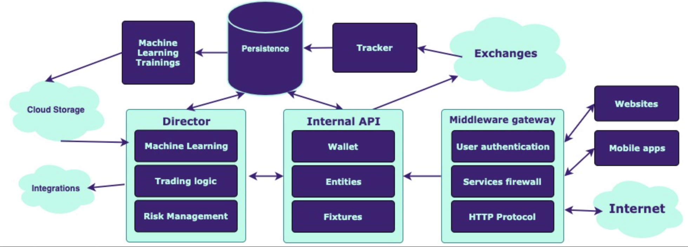

# README #

## The heck this is? ##

### Automated AI Crypto Trader ###

Welcome to Tradis BV legacy code. That belonged to an Amsterdam based startup that is no longer in duty.

Publishing the startup code it's for academic purposes. The founders are glad to expose, publicly, what's about kicking off a startup mostly developed during spare time.

The principles we followed were simple:

- Deliver value as fast as possible
- Leverage quality and delivery times
- Do it now, refactor later

You will see some good practises and some others that are not so much. The first commit was from 2017 and the last commit from 2022, all amended to ensure privacy.

### Company achievements ###

- The company expanded to a total of 15 folks contributing in this current monorepo, among other repositories that are not public (infra, admin, studies...).
- The company held 1.5M EUR in trading volume before dissolving due to lack of investor trust in AI. Yes, folks, AI was not trusted in 2019, but we were doing pretty well in the field.
- Part of Google startup program, AWS startup program and MongoDB startup program.

### What was the company goal? ###

* Automated crypto trading AI
* Crypto exchange integrations
* Expansion to stock markets once licensing

### Contribution guidelines ###

* Writing tests, they were in a separate branch non-finished

---------------------

App Components
==============

### What does it contain? ###

Those are the **current** different components and responsibilities in the monorepo:

 1. Tracker: responsible for integrating scrapping the Binance API in order to retrieve the price and volumes of the desired coin/markets each minute in time, so that the AI is up to date in market values.
    1. Also, an API scrapper is there as a script for dumping months of data per each of the desired coins in a idempotent way to the database. That serves for data backups and AI trainings.
 2. MongoDB: The tracker persist the data in a MongoDB `crypto` database. It has an `aggregation` collection, which is the production one, and an historical collection. The production collection will only contain the data of the previous day and the historical one will contain months of data.
 3. Machine learning: for training and predictions. Will also tell us which coin/market to invest in % over the output
 4. AWS S3 cloud storage: were we store the daily backups from the database. We download them for AI training models in our local machines.
 5. Internal API (**NodeJS**) that talks to MongoDB and exposes several services to the platform:
	 1. Exchange integration
	 2. Gateway for the clients
     3. Bunch of internal services for interoperating with client wallets (Wallet component)
 6. Middleware: Frontend interface / system gateway. The client dashboard interacts with it. Handles user authentication and proxying to the internal API.
 7. Director. There director is a component that interprets AI signals. 
    1. The director decides to what exchange to trade and with what market, ordering to the wallet component.
    2. Each integrated wallet is processed in the background via queueing.
    3. Fully horizontal scale.
    4. Stoploss: it's a differentiated component of the Director. Actually, a bot that helps AI and lets users control their risk appetite. After tons of studies and resources invested, the bot would never beat AI.
 8. Dashboard: public web interface for clients.
 9. AI: all components for training and interpreting ML predictions.

Deployments
-----------
We don't assure you this will work out of the blue, it's been time and some stuff has been removed due to security concerns.
